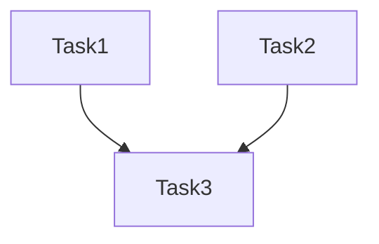

# 任务清单模板

## 文件路径

`specs/TAP-{任务ID}/tasks.md`

## 模板内容

```markdown
# 任务清单 - {任务工单标题}

## 任务列表

### Task 1: {任务名称}

**状态**：待开始 / 进行中 / 已完成

**涉及文件**：
- `path/to/file1.go`
- `path/to/file2.go`

**依赖**：无 / Task X

**描述**：
- 具体要做的改动

**验收标准**：
- [ ] 测试 A 通过
- [ ] 代码审查通过

---

### Task 2: {任务名称}

...

## 依赖关系



## 并行执行分析

- **Task 1, 2**：完全独立，可并行
- **Task 3**：依赖 Task 1, 2，需等待

## 进度跟踪

| 任务 | 状态 | 负责人 | 预计时间 |
|------|------|--------|---------|
| Task 1 | ⏸️ 待开始 | AI | 1h |
| Task 2 | ⏸️ 待开始 | AI | 1h |
| Task 3 | ⏸️ 待开始 | AI | 2h |
```

## 使用说明

1. 将实现计划拆分为独立任务
2. 标注任务间依赖关系
3. 实时更新任务状态
