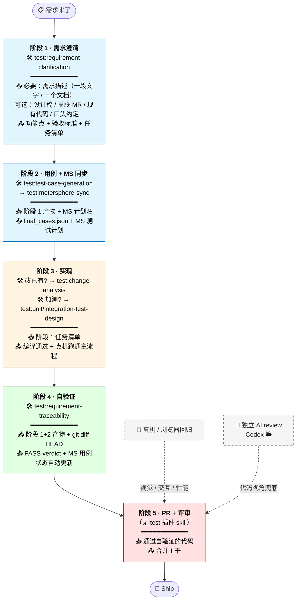

# AI 辅助需求开发实践参考

> 借助 `claude-plugins-marketplace` 的 test 插件进行需求开发和测试验证的标准方法。
>
> 本文档聚焦**怎么把 test 插件用起来**，不复述各 skill 的内部机制 — 那些请直接参考 skill 的 `SKILL.md`。

## 谁该读这份文档

- 即将用 test 插件做完整需求开发的工程师
- 想把 AI 辅助工作流用到自己项目的 Tech Owner
- 已经跑过几次但效果不稳定，想找对的姿势的人

---

## 一图看懂全流程

每阶段实践建议：

| 阶段 | 对应 skill | ✅ 必做 | ❌ 别做 |
| --- | --- | --- | --- |
| **1 需求澄清** | `test:requirement-clarification` | 手头有什么都贴给 AI（描述 / 文档 / 关联 MR / 现有代码路径 / 口头约定） | 带歧义进开发；让 AI 脑补 PM 没说的事 |
| **2 用例生成 + MS 导入** | `test:test-case-generation` → `test:metersphere-sync` | 先配齐 MS 环境变量（凭据 / 项目 ID）；同名计划放心多跑（幂等） | 在这一步纠结单测 / 集成测 — 延后到阶段 3 |
| **3 代码实现** | 改已有：`test:change-analysis` 加测：`test:unit-test-design` / `test:integration-test-design` | 使用 plan mode，先和 AI 对齐开发计划再动手 | 跳过编译堆改动；UI 改动只看 simulator |
| **4 自验证** | `test:requirement-traceability` | `git diff HEAD` 直接喂（不用 commit）；fail 项让 PM/owner 复核；看置信度分布 | 把 PASS 当上线 OK — 还要真机回归 |
| **5 PR** | （无 test 插件 skill） 同行 review + 独立 AI review（Codex 等） | PR description 写完整 test plan（traceability 的 anchor）；触发独立 AI review | 让独立 AI review 替代 traceability — 视角不同，互补不替代 |

---

## 我现在做什么 → 用哪个 skill

| 状态 | skill | 怎么开口 |
| --- | --- | --- |
| 拿到新需求，想理清边界 | `test:requirement-clarification` | 「用 test:requirement-clarification 帮我澄清这个需求：<一段描述 / 文档链接>」 |
| 需求清楚了，生成测试用例 | `test:test-case-generation` | 「用 test:test-case-generation 生成用例，输入：<澄清产物路径>」 |
| 用例生成后导到 MS 平台 | `test:metersphere-sync` | 「用 test:metersphere-sync 同步到 MS 计划 <计划名>」 |
| 改造已有功能，看影响面 | `test:change-analysis` | 「用 test:change-analysis 分析这次改动的影响」 |
| 开发完成，做需求还原度验证 | `test:requirement-traceability` | 「用 test:requirement-traceability 把代码和需求对一遍」 |
| 想给关键模块加单测/集成测 | `test:unit-test-design` / `test:integration-test-design` | 「用 test:unit-test-design 给 <模块> 加单测」 |

每个 skill 的输入、输出、参数见对应的 SKILL.md。下文是「按顺序跑一遍完整长什么样」的扩展版。

---

## Part 1 · 用 test 插件前你要知道的 3 件事

下面 3 件事不是 skill 内部机制，而是**你这边要做的准备**。准备到位，skill 才能跑出靠谱结果。

### 1. 上下文前置 — 把你知道但 AI 不知道的信息都先贴出来

AI 不读你脑子里的东西，它只能用**你显式给的输入** + 它**主动拉的信息**。前者你能控制，后者拼运气。所以**能先贴的就先贴**，不要等它问。

跑 `test:requirement-clarification` 时常被遗漏的输入：

| 信息 | 来源 | 怎么用 |
| --- | --- | --- |
| 关联需求 / 同主题资料 | 工单系统 / 同事告知 | 「这是 X 需求的扩展」「同主题之前做过 Y」 |
| 关联 PR/MR | 同事告诉你 / 工单链接 | 「Server 已合到 MR!19147」 |
| 公司术语 | 团队约定 | 「我们说『需求』指功能改动，不含 bug 修复」 |
| PM 口头决策 | 沟通群 | 「PM 已确认按方案 A 走」 |

跑完看输出里的 `open_questions`：如果一堆都是「需要查 X」「需要找 Y 文档」，说明你最开始没把信息给够，回去补。

### 2. 早澄清 — 别带歧义进开发

返工的根因常常不是代码写错，而是**对需求理解错了**。AI 比人更擅长机械生成代码，**对模糊需求的判断力不如人**。

跑 `test:requirement-clarification` 时：

- 宁可多问 2 轮，别带歧义进开发
- 边界场景在澄清阶段就抛（多 tab 行为差异、特殊角色 / 类型例外、边界数据、异常路径）

### 3. 多层验证 — 不要全靠 AI 自检

AI 生成代码 + AI 自己 review = **同一个偏见**，任何一层都可能漏。所以叠加多层：

| 层 | 抓什么 | 对应动作 |
| --- | --- | --- |
| 静态 / 还原度 | 需求实现完整性、影响面 | `test:requirement-traceability` / `test:change-analysis` |
| 编译 | 类型/引用错误 | 项目自带 build |
| 真机 / 浏览器 | 视觉、交互、性能 | 部署到真实环境跑一遍 |
| 独立 AI review | 同偏见兜底 | Codex 等独立 agent |
| 同行 review | 业务/架构/规范判断 | PR review |

每跳过一层就承担一份风险。新需求建议**全跑一遍**，迭代型小改动可以省真机或独立 review。

---

## Part 2 · 端到端工作流（5 阶段）

> **Workspace 约定**：所有 skill 输出汇聚到 `TEST_WORKSPACE` 环境变量指定的目录（命名建议用需求名 kebab-case，如 `single-message-mgmt-no-notify-delete`），便于跨 skill 消费。配置见各 skill 的 SKILL.md。

### 阶段 1 · 需求澄清

**做什么**：把需求描述 + 设计稿 + 你的额外信息合并成一份「AI 和团队都能对齐」的结构化需求理解，明确所有边界 + 决策。

**用什么 skill**：`test:requirement-clarification`

**怎么开口**：「用 test:requirement-clarification 帮我澄清这个需求：<一段描述 / 文档链接>。关联资料（如有）：<MR / 设计稿 / 历史 PR>」

**最小输入**：以下任一即可启动

- 一段文字描述（口述需求 / 群聊摘录 / 你自己写的草稿）
- 一个需求文档链接（飞书 / wiki / Notion / 工单系统等）

**有的话也贴上**（贴得越全，澄清轮次越少）

- 设计稿（Figma 链接 / 文档内嵌截图）
- 已有实现的 PR/MR 链接（其它端先做了的话，AI 能从代码挖业务规则）
- 现有代码模块路径（如改造已有功能）
- PM/团队口头沟通但文档未写的关键约定

**上下文前置技巧**

- **多端 MR 挖掘**：如果其它端已上线，**贴上他们的 MR 链接** — AI 能从对端代码挖出 API 契约 / 业务规则 / 文案规范，比文档更精确（后面案例会展开）
- **设计稿原图 vs 链接**：链接需要 Figma MCP 才能拉，没启用就贴截图
- **PM 已 ack 的事**：用「补充约定：…」段落显式贴出，AI 不会自己脑补

**期望产出**：一组结构化需求文档（功能点清单、验收标准、平台约束、依赖关系、实现任务清单），所有边界已 PM 确认。

---

### 阶段 2 · 用例生成 + 平台同步

**做什么**：把澄清产物拆成可执行的测试用例，并同步到团队的测试管理平台。

**用什么 skill**：`test:test-case-generation` → `test:metersphere-sync`

**怎么开口**：
- 「用 test:test-case-generation 生成用例」
- 「用 test:metersphere-sync 把 final_cases.json 同步到 MS 计划」

**必备输入**：阶段 1 的全部产物

**跑这两个 skill 容易踩的坑**

- MS 同步前先检查环境变量（凭据 / 项目 ID 等，见 `metersphere-sync` 的 SKILL.md）— 找 @hexiaojun1
- 同步是**幂等**的：同名计划存在就追加，不会重复，所以可以放心多跑几次
- 这阶段只产出 **E2E 验收级用例**；单测 / 集成测延后到实现完成后由 `unit-test-design` / `integration-test-design` 自己读代码判断，不要在这一步纠结

**期望产出**：MS 测试计划上能看到完整用例集，开发和 QA 都可消费。

---

### 阶段 3 · 实现

**做什么**：根据阶段 1 的实现任务清单，AI 主写 + 你 review 完成代码改动。

**用什么 skill**：这一阶段没有专属主 skill，按需启用辅助 skill。

**怎么开口**：
- 切换到 plan mode 进行研发任务规划，确认计划后再让 AI 动手

**辅助 skill（按需用）**

- `test:change-analysis` — 改造已有功能时跑一遍影响面分析（**类继承/共享组件类的需求强烈推荐**，避免父类改动级联到所有子类）
- `test:unit-test-design` / `test:integration-test-design` — 实现完成后跑一遍，让 skill 自己读代码判断哪些纯函数/接口值得下沉，跳过的会列在 `test_plan.md` 里有据可查
- 项目自带的 architecture-overview / ui-component-catalog — 让 AI 先了解项目约定再动手

**期望产出**：编译通过 + 真机/浏览器跑通主流程。

---

### 阶段 4 · 需求验证

**做什么**：把代码改动跟阶段 1 的需求映射起来，检查覆盖完整性、影响面、API 契约一致性，并把结果反馈给团队 QA 平台。

**用什么 skill**：`test:requirement-traceability`

**怎么开口**：「用 test:requirement-traceability 把代码和需求对一遍」

**必备输入**：阶段 1+2 的全部产物 + 代码变更（本地 commit / PR 链接 / diff 文件均可）

**跑这个 skill 容易踩的坑**

- **代码变更不用 commit**：直接喂 `git diff HEAD` 的输出，不用先建 PR
- **fail 项必须人复核**：AI 静态分析倾向「能找出毛病就标 fail」，不复核会把 false positive 同步到 MS 计划
- **看置信度分布**：高置信 Pass 是「代码层面验证通过」；中置信 Pass 通常依赖真机 / server / 组件默认行为 — 这部分要在真机回归阶段重点跑
- **不能替代真机回归**：static 分析抓不到视觉、交互、性能、跨端同步问题，traceability 通过 ≠ 上线 OK

**期望产出**

- 输出报告显示 verdict 是 PASS（或 PASS_WITH_MINOR_ISSUES）
- **如果之前同步过 MS 测试计划**，平台上的用例状态会自动更新成 Pass / Failure / Prepare，Pass 的用例可以不关注，失败或待办状态的用例需要手动验证后标记通过
- 如果 verdict 是 FAIL，会列出具体缺口（哪个需求点没实现、哪个用例没通过）

---

### 阶段 5 · PR + 评审

**做什么**：把改动交付到代码托管平台，触发同行 review + 独立 AI review。

**用什么 skill**：这一阶段不在 test 插件范围，但贯穿质量链路。

**两个对 test 插件下游消费有用的动作**

- **PR description 里写完整 test plan**：每条对应一个验收标准 — 这是后续再跑 traceability 的 anchor
- **触发独立 AI review**：和 traceability 是不同视角的兜底（一个看实现-需求映射，一个看代码本身），别互相替代

**期望产出**：PR 通过 review 合并到主干。

---

## Part 3 · 案例复盘 — iOS TAP-6841255319

### ⚠️ Unfair Advantage 声明

这个 case 有**特殊性**：关联需求的 Server / Android / Web 已经全部上线。iOS 的实现可以**直接抄三端代码** — 这不是其它需求的常态。

**可迁移的部分**（任何项目都用得上）：
- 上下文前置思路（贴所有关联资料 + 多端 MR）
- 5 项 PM 决策的对齐方法（用对照表给 PM 看）
- 真机部署链路
- traceability + 真机回归的双层验证

**不可迁移的部分**（依赖 unfair advantage）：
- 直接挖三端 MR 提取 API 契约 / 业务规则 / 文案
- 「全部对齐 Android 已上线版本」式的兜底策略

下面的复盘**重点描述可迁移的部分**。

### 时间轴（约 3.5 小时完成端到端）

| 阶段 | 耗时 | 主要产物 |
| --- | --- | --- |
| 1. 澄清 + 三端代码挖掘 | 1 h | 6 FP + 5 项 PM 决策 + API 契约全量明确 |
| 2. 用例生成 + MS 同步 | 0.5h | 46 用例 + MS 测试计划 |
| 3. iOS 实现（含真机部署）| 1h | 14 改动文件 + 2 新文件 |
| 4. 自验证（traceability）| 0.5h | 100% 覆盖 / 44 Pass / 2 Inconclusive |
| 5. PR + 评审反馈处理 | 0.5h | PR #148，处理 1 个 Codex finding |

### 关键决策点

**上下文前置的 3 个动作**

1. 在澄清阶段贴上**关联工作项 6686645745** — AI 立刻知道要挖三端 MR
2.澄清阶段对齐 5 项分歧（菜单按钮位置 / 恢复通知 toast 文案 / 恢复按钮文字 / Review 类型隐藏 / icon 视觉规范）的产品功能预期 — 后续开发零返工
3. 在「多变体一致性」维度让 PM 确认「发出的 / 提到我的 / 收到的」三个子 tab 是否都展示菜单按钮

**第三个动作是关键**：它是一类**经常被需求文档漏写的边界**。澄清阶段主动追问比开发后发现错配修复成本低 10 倍。

### 验证侧的双层兜底

- **第一层**：traceability 用 46 条用例对照 PR 代码做用例级正向验证 → 100% 覆盖
- **第二层**：真机部署到设备走一遍主流程 + 边界场景 → 抓到几个视觉细节问题（铃铛位置、删除按钮颜色、文案）

代码层和真机层各抓不同类型的问题：代码层抓「实现是否对齐契约」，真机层抓「视觉/交互是否符合设计」，两层都跑才能放心。

### Recap：这次最值得带走的 3 个习惯

1. **关联资料 / MR / 设计稿先翻一遍再开始澄清** — 30 分钟换后续 3 小时
3. **traceability + 真机部署双层验证** — 不要全靠任何单层 review

---

## 附：进一步阅读

每个 skill 的细节请看对应的 SKILL.md：

- `plugins/test/skills/requirement-clarification/SKILL.md`
- `plugins/test/skills/requirement-review/SKILL.md`
- `plugins/test/skills/test-case-generation/SKILL.md`
- `plugins/test/skills/metersphere-sync/SKILL.md`
- `plugins/test/skills/change-analysis/SKILL.md`
- `plugins/test/skills/requirement-traceability/SKILL.md`
- `plugins/test/skills/unit-test-design/SKILL.md`
- `plugins/test/skills/integration-test-design/SKILL.md`
