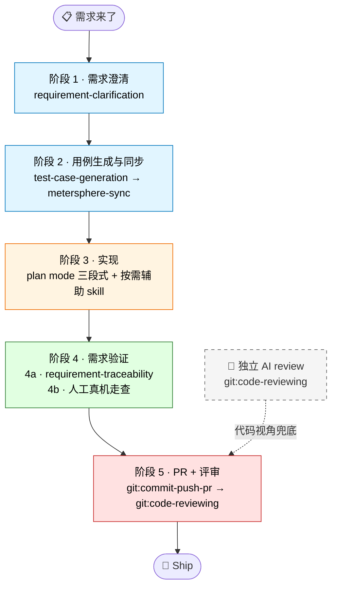

# AI 辅助需求开发实践参考

> 借助 `claude-plugins-marketplace` 的 test 插件进行需求开发和测试验证的标准方法。
>
> 本文档聚焦**怎么把 test 插件用起来**，不复述各 skill 的内部机制 — 那些请直接参考 skill 的 `SKILL.md`。

## 谁该读这份文档

- 即将用 test 插件做完整需求开发的工程师
- 想把 AI 辅助工作流用到自己项目的 Tech Owner
- 已经跑过几次但效果不稳定，想找对的姿势的人

---

## 30 秒速查

| 阶段 | 主 skill | 一句话 |
| --- | --- | --- |
| 1 · 需求澄清 | `test:requirement-clarification` | 把需求 + 关联资料一次喂全，产出功能点 / 验收标准 / 任务清单 |
| 2 · 用例生成与同步 | `test:test-case-generation` → `test:metersphere-sync` | 生成 E2E 用例并幂等同步到 MeterSphere 测试计划 |
| 3 · 实现 | 无主 skill（靠 plan mode + 按需辅助） | plan mode 三段式（设计 → 评审 → 实施）→ 编译 + 关键路径冒烟 |
| 4 · 需求验证 | `test:requirement-traceability` + 人工真机走查 | AI 跑还原度（diff 对照需求），人工补真机 UI / 体验验收 |
| 5 · PR + 评审 | `git:commit-push-pr` → `git:code-reviewing` | 创建 PR/MR + 跑 AI 代码审查，PR description 含完整 test plan |

> **MS = MeterSphere**：团队使用的测试管理平台，承接用例管理与测试计划管理。下文统一用「MS」简称。
>
> **Workspace 约定**：所有 skill 输出汇聚到 `TEST_WORKSPACE` 环境变量指定的目录（命名建议用需求名 kebab-case，如 `single-message-mgmt-no-notify-delete`），便于跨 skill 消费。配置见各 skill 的 SKILL.md。

---

## 分阶段 SOP

### 阶段 1 · 需求澄清

**做什么**：把需求描述 + 设计稿 + 你的额外信息合并成一份「AI 和团队都能对齐」的结构化需求理解，明确所有边界 + 决策。

**用什么 skill**：`test:requirement-clarification`

**怎么开口**：「用 test:requirement-clarification 帮我澄清这个需求：<一段描述 / 文档链接>。关联资料（如有）：<MR / 设计稿 / 历史 PR>」

**最小输入**：以下任一即可启动

- 一段文字描述（口述需求 / 群聊摘录 / 你自己写的草稿）
- 一个需求文档链接（飞书 / wiki / Notion / 工单系统等）

**有的话也贴上**（贴得越全，澄清轮次越少）

- 设计稿（Figma 链接 / 文档内嵌截图）
- 已有实现的 PR/MR 链接（其它端先做了的话，AI 能从代码挖业务规则）
- 现有代码模块路径（如改造已有功能）
- PM/团队口头沟通但文档未写的关键约定

#### 🔑 核心原则 — 上下文前置

AI 不读你脑子里的东西，它只能用**你显式给的输入** + 它**主动拉的信息**。前者你能控制，后者拼运气。所以**能先贴的就先贴**，不要等它问。

常被遗漏的输入：

| 信息 | 来源 | 怎么用 |
| --- | --- | --- |
| 关联需求 / 同主题资料 | 工单系统 / 同事告知 | 「这是 X 需求的扩展」「同主题之前做过 Y」 |
| 关联 PR/MR | 同事告诉你 / 工单链接 | 「Server 已合到 MR!19147」 |
| 公司术语 | 团队约定 | 「我们说『需求』指功能改动，不含 bug 修复」 |
| PM 口头决策 | 沟通群 | 「PM 已确认按方案 A 走」 |

实操技巧：

- **多端 MR 挖掘**：如果其它端已上线，**贴上他们的 MR 链接** — AI 能从对端代码挖出 API 契约 / 业务规则 / 文案规范，比文档更精确（后面案例会展开）
- **设计稿原图 vs 链接**：链接需要 Figma MCP 才能拉，没启用就贴截图
- **PM 已 ack 的事**：用「补充约定：…」段落显式贴出，AI 不会自己脑补

跑完看输出里的 `open_questions`：如果一堆都是「需要查 X」「需要找 Y 文档」，说明你最开始没把信息给够，回去补。

#### 🔑 核心原则 — 早澄清

返工的根因常常不是代码写错，而是**对需求理解错了**。AI 比人更擅长机械生成代码，**对模糊需求的判断力不如人**。

- 宁可多问 2 轮，别带歧义进开发
- 边界场景在澄清阶段就抛（多 tab 行为差异、特殊角色 / 类型例外、边界数据、异常路径）

**期望产出**：一组结构化需求文档（功能点清单、验收标准、平台约束、依赖关系、实现任务清单），所有边界已 PM 确认。

---

### 阶段 2 · 用例生成与同步至 MS

**做什么**：把澄清产物拆成可执行的测试用例，并同步到团队的测试管理平台（MS）。

**用什么 skill**：`test:test-case-generation` → `test:metersphere-sync`

**怎么开口**：
- 「用 test:test-case-generation 生成用例」
- 「用 test:metersphere-sync 把 final_cases.json 同步到 MS 计划」

**必备输入**：阶段 1 的全部产物

**容易踩的坑**

- MS 同步前先检查环境变量（凭据 / 项目 ID 等，见 `metersphere-sync` 的 SKILL.md）— 找 @hexiaojun1
- 同步是**幂等**的：同名计划存在就追加，不会重复，所以可以放心多跑几次
- 这阶段只产出 **E2E 验收级用例**；单测 / 集成测延后到实现完成后由 `unit-test-design` / `integration-test-design` 自己读代码判断，不要在这一步纠结

**期望产出**：MS 测试计划上能看到完整用例集，开发和 QA 都可消费。

---

### 阶段 3 · 实现

**做什么**：根据阶段 1 的任务清单，AI 主写 + 你 review 完成代码改动。

**用什么 skill**：无专属主 skill，靠 plan mode + 按需辅助 skill。

**怎么做（plan mode 三段式）**

1. **设计**：进入 plan mode，贴上阶段 1 任务清单 + 项目 architecture-overview / ui-component-catalog 等约定文档，让 AI 出开发计划
2. **评审**：exit plan 前挑战三点 — 影响面（命中共享组件 / 父类时加跑 `test:change-analysis`）、分步顺序（能不能拆成可单步编译的小步）、回滚成本
3. **实施**：按计划改代码，**每完成一个任务点编译一次**，不要堆到最后才 build

**辅助 skill（按需）**

- `test:change-analysis` — 改共享组件 / 父类时的影响面分析（类继承类需求强烈推荐）
- `test:unit-test-design` / `test:integration-test-design` — 写完后让 skill 读代码判断哪些纯函数 / 接口值得下沉，跳过项会列在 `test_plan.md` 里有据可查

**期望产出**：编译通过 + 关键路径冒烟（确保不崩）。系统性的真机走查留到阶段 4b。

---

### 阶段 4 · 需求验证

**做什么**：从「代码层」+「真机层」两侧把改动对照阶段 1 的需求做正向核对，确保功能 / 视觉 / 体验都到位。**AI 抓代码-需求映射，人盯真机表现，缺一不可**。

#### 子步骤 4a · AI 还原度检查

**用什么 skill**：`test:requirement-traceability`

**怎么开口**：「用 test:requirement-traceability 把代码和需求对一遍」

**必备输入**：阶段 1+2 的全部产物 + 代码变更（本地 commit / PR 链接 / diff 文件均可）

**容易踩的坑**

- **代码变更不用 commit**：直接喂 `git diff HEAD` 的输出，不用先建 PR
- **fail 项必须人复核**：AI 静态分析倾向「能找出毛病就标 fail」，不复核会把 false positive 同步到 MS 计划
- **看置信度分布**：高置信 Pass = 代码层面验证通过；中置信 Pass 通常依赖真机 / server / 组件默认行为 — 这部分丢给 4b 重点跑

**产出**

- 还原度报告 verdict = PASS（或 PASS_WITH_MINOR_ISSUES）；FAIL 会列出具体缺口（哪个需求点没实现、哪个用例没通过）
- MS 用例状态自动回写为 Pass / Failure / Prepare（Failure / Prepare 项交给 4b 复核）

#### 子步骤 4b · 人工真机走查

**做什么**：把代码部署到真机 / 浏览器，自己走一遍主流程 + 边界场景，关注 AI 抓不到的视觉、交互、体验。

**为什么不能省**：4a PASS ≠ 上线 OK。AI 静态分析看不到这些层面：

- 视觉：颜色、间距、对齐、字号、icon 还原
- 交互：手势、动效、loading / 空 / 异常态
- 体验：滚动卡顿、首屏白屏、点击反馈
- 跨端一致性：Server 推送、多端状态同步

**怎么做**

- 4a 输出里的中置信 Pass 项，全部在真机上手动复跑一遍
- 走完后到 MS 平台把 Failure / Prepare 状态的用例手动验证并更新

**产出**：MS 用例全部进入 Pass 状态 + 视觉 / 交互 issue 清单（修完才能进阶段 5）

#### 🔑 核心原则 — 多层验证

AI 生成代码 + AI 自己 review = **同一个偏见**，任何一层都可能漏。需求验证占其中两层（4a + 4b），整条链路要叠加：

| 层 | 抓什么 | 对应阶段 |
| --- | --- | --- |
| 编译 | 类型 / 引用错误 | 阶段 3 项目自带 build |
| 静态 / 还原度 | 需求实现完整性、影响面、API 契约 | 阶段 4a · traceability |
| 真机 / 浏览器 | 视觉、交互、体验、跨端一致性 | 阶段 4b · 人工走查 |
| 独立 AI review | 同偏见兜底 | 阶段 5 `git:code-reviewing` |
| 同行 review | 业务 / 架构 / 规范判断 | 阶段 5 PR review |

每跳过一层就承担一份风险。新需求建议**全跑一遍**，迭代型小改动可以省 4b 或独立 AI review。

---

### 阶段 5 · PR + 评审

**做什么**：把改动交付到代码托管平台，触发同行 review + 独立 AI review。

**用什么 skill**（git 插件提供，非 test 插件）：

- `git:commit-push-pr` — 提交、推送、创建 MR/PR、监控 Pipeline
- `git:code-reviewing` — AI 代码审查（Claude Code 下双视角辩论 / Codex 下串行双视角交叉验证）

**两个关键动作**

- **PR description 里写完整 test plan**：每条对应一个验收标准 — 这是后续再跑 traceability 的 anchor
- **跑 `git:code-reviewing`**：和阶段 4a traceability 是不同视角的兜底（一个看实现-需求映射，一个看代码本身），别互相替代

**期望产出**：PR 通过 review 合并到主干。

---

## 案例复盘 — iOS TAP-6841255319

### ⚠️ Unfair Advantage 声明

这个 case 有**特殊性**：关联需求的 Server / Android / Web 已经全部上线。iOS 的实现可以**直接抄三端代码** — 这不是其它需求的常态。

**可迁移的部分**（任何项目都用得上）：
- 上下文前置思路（贴所有关联资料 + 多端 MR）
- 5 项 PM 决策的对齐方法（用对照表给 PM 看）
- traceability + 真机走查的双层验证

**不可迁移的部分**（依赖 unfair advantage）：
- 直接挖三端 MR 提取 API 契约 / 业务规则 / 文案
- 「全部对齐 Android 已上线版本」式的兜底策略

下面的复盘**重点描述可迁移的部分**。

### 时间轴（约 3.5 小时完成端到端）

| 阶段 | 耗时 | 主要产物 |
| --- | --- | --- |
| 1. 澄清 + 三端代码挖掘 | 1 h | 6 FP + 5 项 PM 决策 + API 契约全量明确 |
| 2. 用例生成与 MS 同步 | 0.5h | 46 用例 + MS 测试计划 |
| 3. iOS 实现（含真机部署）| 1h | 14 改动文件 + 2 新文件 |
| 4. 需求验证（traceability + 真机走查）| 0.5h | 100% 覆盖 / 44 Pass / 2 Inconclusive + 真机抓到 3 个视觉细节 |
| 5. PR + 评审反馈处理 | 0.5h | PR #148，处理 1 个 Codex finding |

### 关键决策点

**上下文前置的 3 个动作**

1. 在澄清阶段贴上**关联工作项 6686645745** — AI 立刻知道要挖三端 MR
2. 澄清阶段对齐 5 项分歧（菜单按钮位置 / 恢复通知 toast 文案 / 恢复按钮文字 / Review 类型隐藏 / icon 视觉规范）的产品功能预期 — 后续开发零返工
3. 在「多变体一致性」维度让 PM 确认「发出的 / 提到我的 / 收到的」三个子 tab 是否都展示菜单按钮

**第三个动作是关键**：它是一类**经常被需求文档漏写的边界**。澄清阶段主动追问比开发后发现错配修复成本低 10 倍。

### 验证侧的双层兜底

- **第一层**：traceability 用 46 条用例对照 PR 代码做用例级正向验证 → 100% 覆盖
- **第二层**：真机部署到设备走一遍主流程 + 边界场景 → 抓到 3 个视觉细节问题（铃铛位置、删除按钮颜色、文案）

代码层和真机层各抓不同类型的问题：代码层抓「实现是否对齐契约」，真机层抓「视觉/交互是否符合设计」，两层都跑才能放心。

### Recap：这次最值得带走的 2 个习惯

1. **关联资料 / MR / 设计稿先翻一遍再开始澄清** — 30 分钟换后续 3 小时
2. **traceability + 真机走查双层验证** — 不要全靠任何单层 review

---

## 附：进一步阅读

每个 skill 的细节请看对应的 SKILL.md：

- `plugins/test/skills/requirement-clarification/SKILL.md`
- `plugins/test/skills/test-case-generation/SKILL.md`
- `plugins/test/skills/metersphere-sync/SKILL.md`
- `plugins/test/skills/change-analysis/SKILL.md`
- `plugins/test/skills/requirement-traceability/SKILL.md`
- `plugins/test/skills/unit-test-design/SKILL.md`
- `plugins/test/skills/integration-test-design/SKILL.md`
- `plugins/git/skills/commit-push-pr/SKILL.md`（阶段 5）
- `plugins/git/skills/code-reviewing/SKILL.md`（阶段 5）
